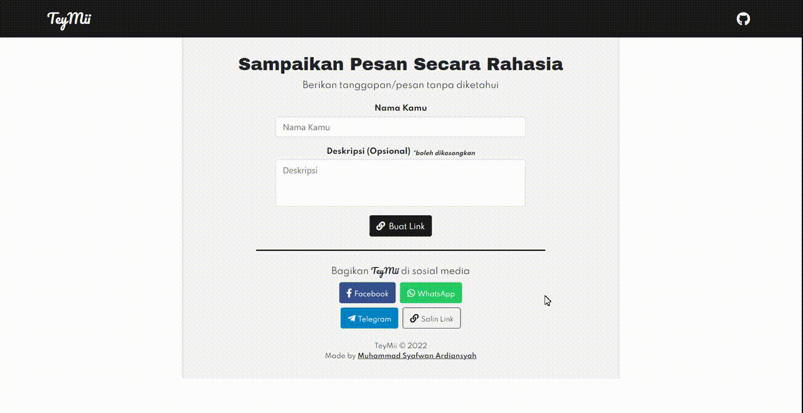
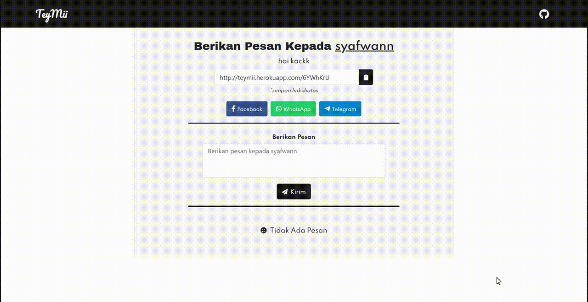

    

## TeyMii - Sampaikan Pesan Secara Rahasia

TeyMii adalah web yang menghubungkan dengan teman/sahabat/orang lain, melalui pesan secara rahasia tanpa diketahui siapa pengirimnya

## Clone This Repository

- Clone your project
- Go to the folder application using `cd` command on your cmd or terminal
- Run `composer install` on your cmd or terminal
- Copy `.env.example` file to `.env` on the root folder
- Open your `.env` file and change the database name (`DB_DATABASE`) to whatever you have, username (`DB_USERNAME`) and password (`DB_PASSWORD`) field correspond to your configuration
- Run `php artisan key:generate`
- Run `php artisan migrate`
- Run `php artisan serve`
- Go to http://localhost:8000/
